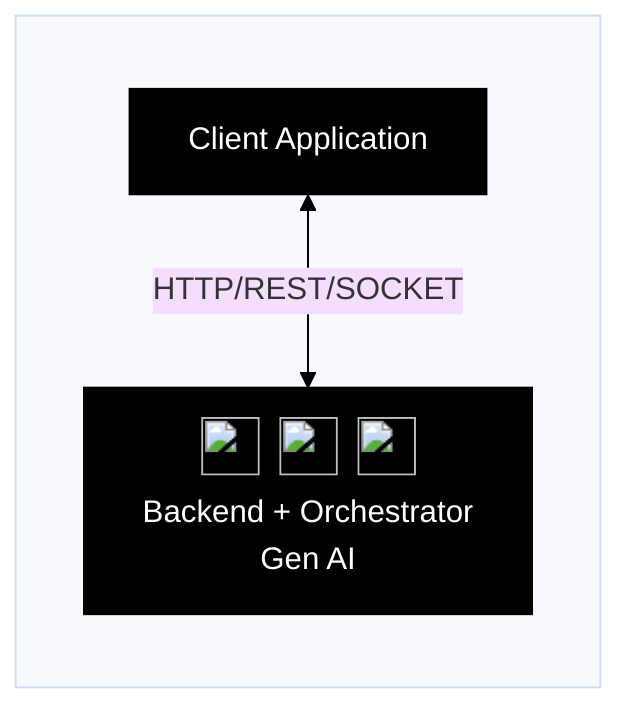

```mermaid
%%{init: {'theme': 'base', 'themeVariables': { 'background': '#FFFFFF' }}}%%
graph LR
    subgraph  
        Client["Client Application"]
        
        BE["<span style='display:inline-block; margin-right:10px'><img src='FunctionApp.svg' width='30' height='30' /></span><span style='display:inline-block; margin-right:10px'><img src='APIManager.svg' width='30' height='30' /></span><span style='display:inline-block'><img src='VirtualMachine.svg' width='30' height='30' /></span><br>Backend + Orchestrator<br>Gen AI"]
        
        Client <-->|HTTP/REST/SOCKET| BE
    end

    %% Azure-themed styling
    style Client fill:#000000,stroke:#000000,color:white
    style BE fill:#000000,stroke:#000000,color:white
```
