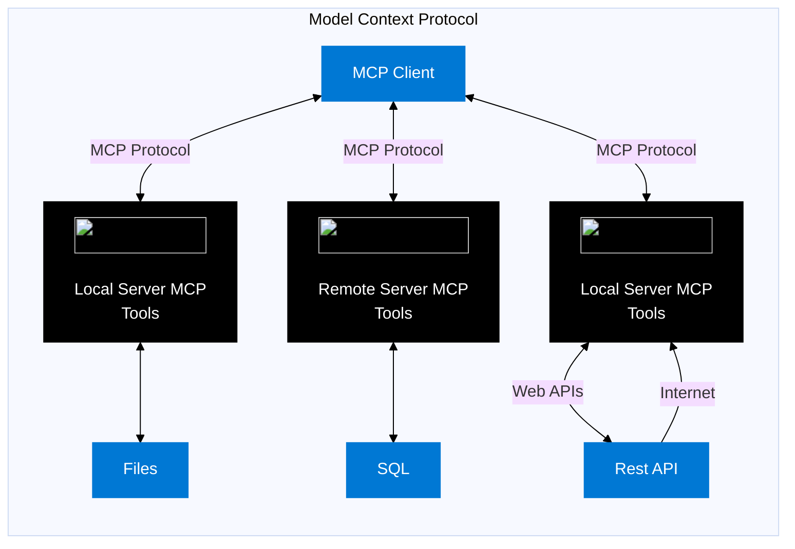

```mermaid
%%{init: {'theme': 'base', 'themeVariables': { 'background': '#FFFFFF' }}}%%
graph LR
    subgraph Model Context Protocol
        Client["MCP Client"]
        A["<img src='VirtualMachine.svg' width='36' height='36' /><br>Local Server MCP<br>Tools"]
        B["<img src='FunctionApp.svg' width='36' height='36' /><br>Remote Server MCP"<br>Tools]
        C["<img src='VirtualMachine.svg' width='36' height='36' /><br>Local Server MCP<br>Tools"]
        
        Client <-->|MCP Protocol| A
        Client <-->|MCP Protocol| B
        Client <-->|MCP Protocol| C
        
        A <--> D[Files]
        B <--> E[SQL]
        C <-->|Web APIs| F[Rest API]
    end
    F -->|Internet| C

    %% Azure-themed styling
    style Client fill:#0078D4,stroke:#0078D4,color:white
    style A fill:#000000,stroke:#000000,color:white
    style B fill:#000000,stroke:#000000,color:white
    style C fill:#000000,stroke:#000000,color:white
    style D fill:#0078D4,stroke:#0078D4,color:white
    style E fill:#0078D4,stroke:#0078D4,color:white
    style F fill:#0078D4,stroke:#0078D4,color:white
```