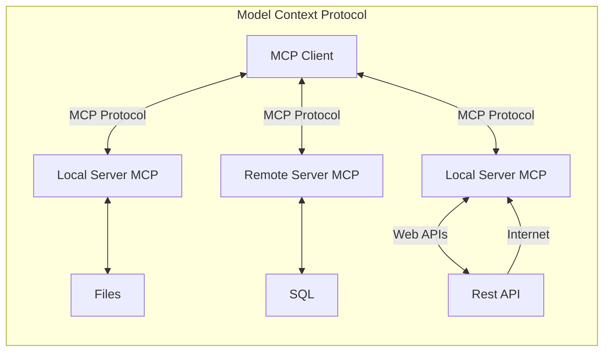

```mermaid
graph LR
    subgraph Model Context Protocol
        Client["MCP Client"]
        A[Local Server MCP]
        B[Remote Server MCP ]
        C[Local Server MCP]
        
        Client <-->|MCP Protocol| A
        Client <-->|MCP Protocol| B
        Client <-->|MCP Protocol| C
        
        A <--> D[Files ]
        B <--> E[SQL]
        C <-->|Web APIs| F[Rest API]
    end
    F -->|Internet| C
```