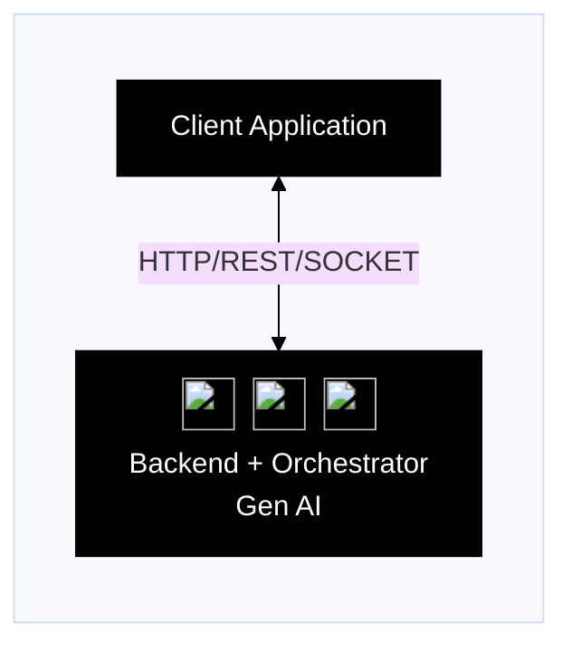
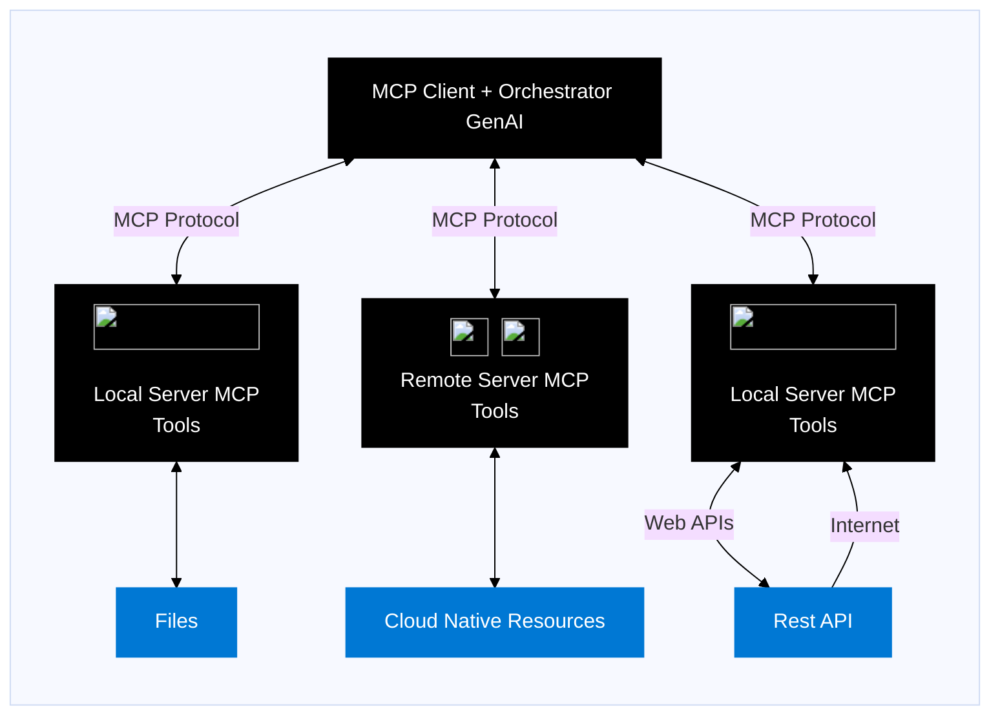

# Context Chat - MCP Server Implementation

This project demonstrates how to implement a Message Channel Protocol (MCP) server using Azure Functions. MCP enables standardized communication between client applications and AI services, making it easier to build robust and scalable AI-powered applications.

## Architecture

### Before MCP Implementation

The diagram below shows a traditional architecture before implementing MCP, where clients communicate directly with backend services using various protocols:

### Traditional Architecture


### Model Context Protocol

## Prerequisites

- [Azure Developer CLI (azd)](https://learn.microsoft.com/azure/developer/azure-developer-cli/install-azd) for deployment
- [.NET 8 SDK](https://dotnet.microsoft.com/download/dotnet/8.0)
- [Azure Functions Core Tools](https://learn.microsoft.com/azure/azure-functions/functions-run-local#install-the-azure-functions-core-tools)
- Azure subscription

## Getting Started

### Local Development

1. Clone this repository
2. Configure user secrets for local development:

```bash
dotnet user-secrets set "MODEL" "gpt-4o-mini"
dotnet user-secrets set "ENDPOINT" "<your-openai-endpoint>"
dotnet user-secrets set "API_KEY" "<your-api-key>"

{
    "servers": {
        "my-mcp-server": {
            "type": "sse",
            "url": "<function-app-name>.azurewebsites.net/runtime/webhooks/mcp/sse",
            "headers": {
                "x-functions-key": "${input:functions-mcp-extension-system-key}"
            }
        }
    }
}
```